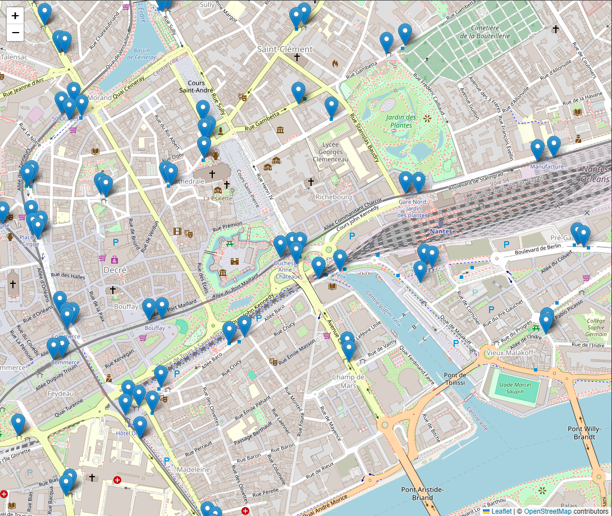

# rendu

## défaut des données

- Les arrêts sont dupliqués pour chaque ligne et destination possible (ex: arrêt "Duchesse Anne" est présent 4 fois)
  - Chaque arrêt à des enfants (qui sont les différentes lignes qui passent par cet arrêt) mais il ne sont pas liés dans les données et nous devons les liers nous même.
- Pour récupérer toutes les informations concernant une lignes nous devons passer par 4 entités différentes (stop, route, trip, stop_time)
- Certains arrêts sont mal placés (on peux comparer avec la carte) (ex: Duchesse Anne)
- Aucune informations/documentation n'est disponible pour comprendre les valeurs des champs (ex: route_type, wheelchair_boarding)
  - Nous avons du comparer les valeurs avec nos connaissances pour comprendre les valeurs

## Les info sur les données

### Arrêts

- **wheelchair_boarding**:
  - 1: Accessible
  - 2: Pas accessible
- **route_type**:
  - 0: Tramway
  - 3: Bus
